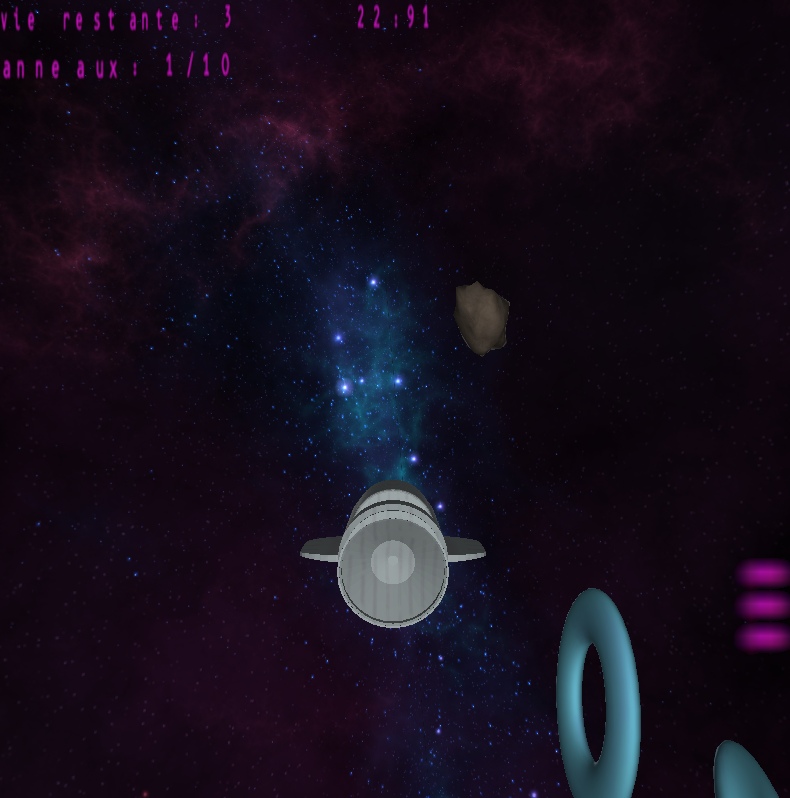
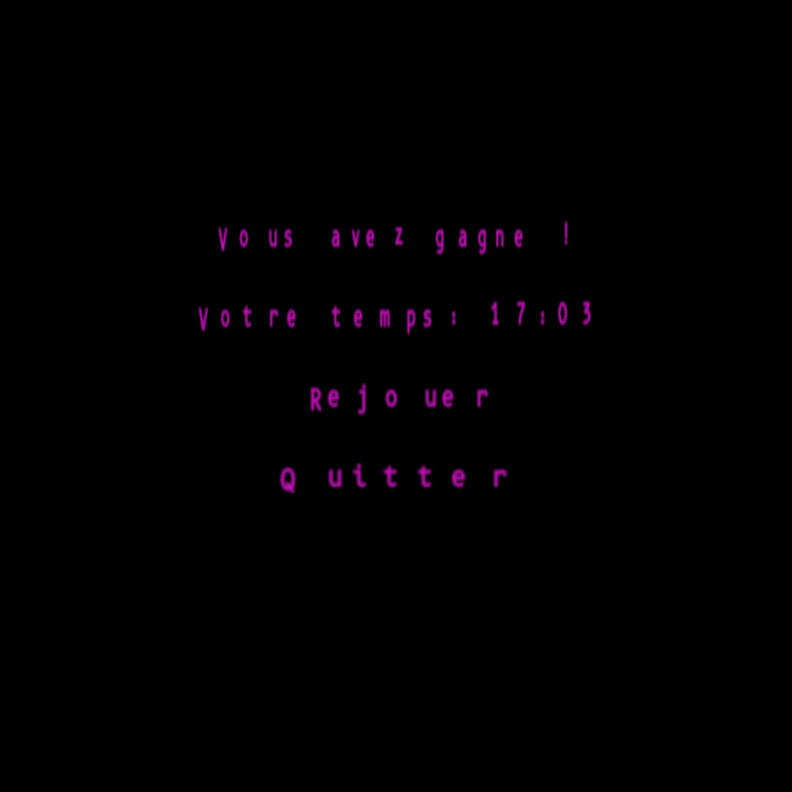
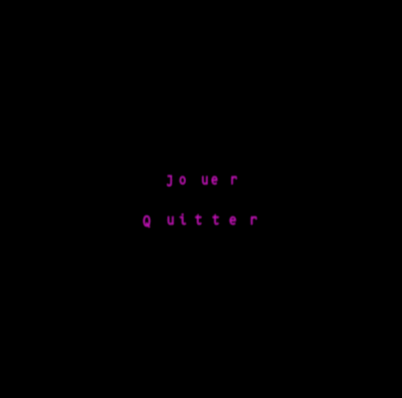
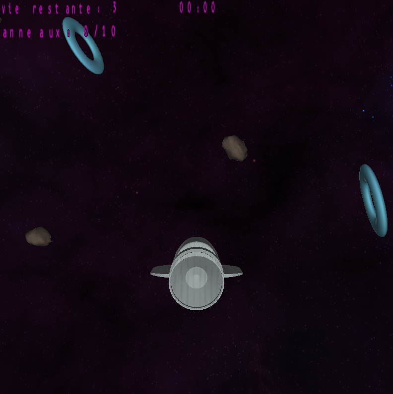
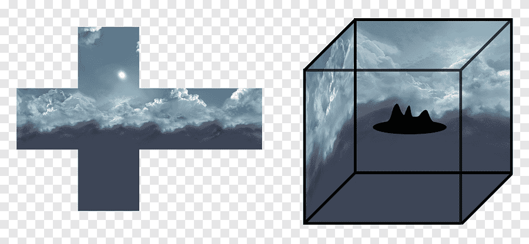
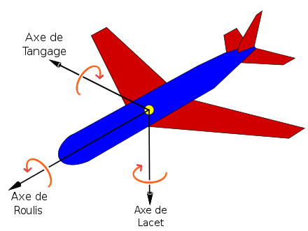
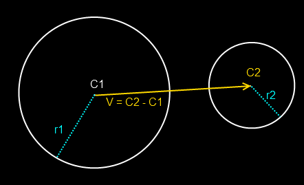

# Space race OpenGL - 2022 / 2023

## Table of content
1. [General Information](#general-info)
2. [Technologies](#technologies)
3. [Goals](#objectifs)
4. [Files Organisation](#explaination)
5. [How to use](#how-to-use)
6. [Conclusion et problèmes rencontrés](#conclusion)


***
<a name="general-info"></a>
## General Information

This project was carried out for the Image Processing and Synthesis subject of semester 6 of the engineering school CPE Lyon.

The goal of this project is to make a game using the OpenGL library.

The subject of the game was free, but must contain at least two different graphic programs, user interactions and also intelligent reuse of objects (displayed several times).

Some files were provided to simplify the implementation of the project notably on the shader side.

Note that this project was done as part of a school project

***
<a name="technologies"></a>
## Technologies

A list of technologies used within the project:
* [Python](https://www.python.org/)
* [OpenGL](https://www.opengl.org/)
* [PIL](https://pillow.readthedocs.io/en/stable/)
* [glfw](https://www.glfw.org/)
* [pyrr](https://pypi.org/project/Pyrr/)
* [numpy](https://numpy.org/)
* [time](https://docs.python.org/fr/3/library/time.html)
* [random](https://docs.python.org/fr/3/library/random.html)
* [os](https://docs.python.org/fr/3/library/os.html)
* [ctypes](https://docs.python.org/fr/3/library/ctypes.html)


***
<a name="objectifs"></a>
## Goals

I decided to make a "racer" game in space. The player must pass checkpoints (rings) as quickly as possible, while avoiding obstacles (asteroids).



The player controls a spaceship that can move in all three dimensions of space. It can accelerate, brake, turn left or right, lean up or down and roll over.

The game ends when the player has passed all the checkpoints. The time taken by the player is then displayed on the screen.



When the player touches an obstacle, he loses speed. If he touches 3 obstacles, the game ends and the time taken by the player is displayed on the screen.

There is 1 menu that appears at the beginning and end of the game to allow the player to start a game or leave the game.



The timer is displayed in the top left corner of the screen and only starts when the player has started moving (forward or backward). But it can turn on itself at first, without the stopwatch starting.

To the left of it is the number of lives remaining to the player. There are 3 lives at the beginning of the game. And below, the number of checkpoints passed by the player, on the total number of checkpoints.

On the right is a speedometer of the ship. It is represented by a purple bar. The more the bar is filled, the faster the ship goes (whether forward or backward). When the ship hits an obstacle, the bar decreases (because the player loses speed).




***
<a name="explaination"></a>
## Files Organisation

The project files are organized as follows :
```
├── cpe3d.py
├── glutils.py
├── main.py
├── mesh.py
├── viewerGL.py
├── shaders
│   ├── gui.frag
│   ├── gui.vert
│   ├── shader.frag
│   ├── shader.vert
│   └── skybox.frag
├── assets
│   ├── asteroids
│   │   ├── asteroid_texture.jpg
│   │   └── asteroid.obj
│   ├── rings
│   │   ├── ring_texture.jpg
│   │   └── ring.obj
│   ├── skybox
│   │   ├── corona_bk.png
│   │   ├── corona_dn.png
│   │   ├── corona_ft.png
│   │   ├── corona_lf.png
│   │   ├── corona_rt.png
│   │   └── corona_up.png
│   ├── spaceship
│   │   ├── spaceship_texture.jpg
│   │   └── spaceship.obj
│   └── fontB.jpg
```

### [```assets```](./assets)
This folder contains the different 3D objects used in the game. Each is respectively stored in their own folder. The file [```fontB.jpg```](./assets/fontB.jpg) contains the characters used to display the text on the screen.
In the 3 folders : [```asteroids```](./assets/asteroids), [```rings```](./assets/rings) and [```spaceship```](./assets/spaceship), there is a ```.obj``` file which contains the shape information of the object, and a ```.jpg``` file which contains the texture information of the object.
Finally in the folder [```skybox```](./assets/skybox), there are 6 images that will be used to make the 6 sides of the skybox.
#

### [```shaders```](./shaders)
This file contains the different shaders used in the game (vertex and fragment). There is 1 shader used for displaying texts: [```gui.vert```](./shaders/gui.vert) and [```gui.frag```](./shaders/ gui.frag). And 2 shaders used for displaying 3D objects: [```shader.vert```](./shaders/shader.vert) and [```shader.frag```](./shaders/shader .frag). And finally, a shader used for displaying the skybox: [```skybox.frag```](./shaders/skybox.frag) which is done differently from other 3D objects (because there is no shadow projected on the skybox).
#

### [```cpe3d.py```](./cpe3d.py)
In this file, you find the classes ```Transformation3D```, ```Object```, ```Object3D```, ```Camera``` and ```Text```, which allow to create game objects. There are 3 types of objects here: 3D objects, the camera and texts.

The main difference here, with the basic file provided, is the management of the control of the ship in space. To do this, I had to modify the initialization of the objects to no longer use Euler angles to define their rotation, but rather use quaternions.

This makes possible to avoid having the “gimbal lock” problem (which is a problem in the representation of Euler angles). And this also allows the player to be able to rotate on several axes at the same time (impossible with Euler angles and necessary for a game in space).


The image above represents the problem of the "gimbal lock". We see that when we make a rotation on the Y axis while all the axes are aligned, it is equivalent to making a rotation on the Z axis.

An example of how quaternions work is available here: [quaternions.online](https://quaternions.online/), and explanations of how quaternions work here: [wikipedia.org](https://fr.wikipedia.org/wiki/Quaternion) and [lucidar.me](https://lucidar.me/fr/quaternions/quaternions-rotations/).
#

### [```glutils.py```](./glutils.py)
In this file is the functions ```compile_shader```, ```create_program```, ```create_program_from_file``` and ```load_texture```, which load textures, shaders and to create OpenGL programs. There have been no changes to this file.
#

### [```mesh.py```](./mesh.py)
In this file is the ```Mesh``` class which create the 3D objects of the game. There have been no changes in this file.
#

### [```main.py```](./main.py)
This file is the main file of the game. It is this one which will be executed to launch the game. It allow to create the game objects by calling on the other files ([```glutils.py``` ](./glutils.py), [```mesh.py```](./mesh.py) and [```cpe3d.py```](./cpe3d.py)).

File execution begins by defining 3 important constants for the rest of the game: the number of asteroids, the number of rings and a seed for the random generation of asteroids and rings (their placement in space and their rotation). The choice of this seed therefore allows the choice of the "map" for the game.

It start by creating the game window with the function by launching the ViewerGL class (put in the viewer variable). It will then create the OpenGL programs for shaders and textures (explained earlier). It then created a series of functions to facilitate the creation of objects according to their type (3D objects, writing, image, etc.). These functions notably facilitate the creation of several similar objects (with the same VAO and texture) but with different positions.

It finally create our objects in a specific order so that they are displayed in the correct order (in terms of superposition). It start with the 3D objects (ship, skybox, asteroids, rings), then the texts (score, lives, speed) and the texts useful for the menus. It is at this stage that it define their position and size. Finally, it launch the main loop of the game which runs in the viewer.
#

### [```viewerGL.py```](./viewerGL.py)
This file is the file that launch the main loop of the game. It will manage events (keyboard, mouse) and update game objects.

Execution of the file begins when the viewer object is created by the file [```main.py```](./main.py). It start by creating the game window with the ```glfw.create_window``` function. It will then allow event management (esc key on the keyboard to close the window and pressing the mouse button to use the menus). It will then initialize a bunch of variables and constants related to the game.

- self.screen: which allow to know which screen the player are on (main menu, game, end menu),
- self.objs, self.objs_start_menu and self.objs_end_menu: which allow to store the objects of the game, the main menu and the end menu (i.e. for the last 2 texts to display when these menus are displayed),
- self.border: which allow to define the limits of the game, in order to prevent the player from leaving the game area (moving too far from the area with the asteroids and rings). This distance must be chosen to be able to contain the entire playing field, but small enough so that the objects are always displayed on the screen (even if the player is at the edge of the playing area),
- self.current_quaterion: which store the current rotation of the ship; because it can be difficult to calculate the current rotation of the ship from the rotation matrix (see [pyrr documentation](https://pyrr.readthedocs.io/en/latest/api_quaternion.html)), so it store the current rotation in this variable in parallel to its change in the ship rotation matrix.

There is then the 2 functions called earlier to allow event management. Note for the second ```mouse_button_callback``` the menu management. It start by recovering the position of the mouse, which is recalculate according to the size of the screen. Then check if the player are on the main menu or on the end menu.

Then there is 2 functions used by [```main.py```](./main.py) for adding objects: The first function allows to add an object to the list of game objects. The second function allows to add the camera to its corresponding variable.

And then the main function of the file (main loop of the game). The ```run``` function will launch the main loop of the game. It is called at the end of the file [```main.py```](./main.py) and manage the sequential execution of our menus. It begins by calling the ```run_menu_start```. When the player press Play and switch to the game, the ```run_menu_start``` function ends (because a condition of the loop is no longer checked) and the ```run``` function continues its execution. Then it call the ```run_game``` function which start the game. When the player loses or wins, the ```run_game``` function ends and the ```run``` function continues its execution. And will then call the ```run_menu_end``` function which  display 2 buttons as well as the result of the game.

The ```run_game``` function will call the other functions of this file. It start, as in the other "run_" functions, by cleaning the screen. Then update the keys currently pressed and make the player move (depending on his speed and the direction in which he is heading). It then use a series of 3 functions which make possible to search for the 3 types of collision that the game is trying to detect (between the ship and the asteroids, between the ship and the rings and between the ship and the borders of the map). It then call on another function which update the position of the camera (by reproducing the movement of the ship). Then it move the "skybox".

The skybox is in reality a cube formed by 6 images, surrounding the player, when he moves, he will approach one of the side. To prevent the impression of moving in a cube and not in space, the game have to move the skybox with the player (same translation), in such a way that the player, whatever his movement are, will always be in the center of the skybox and will never get closer to the images forming the skybox. Consider the following principle applied on a small scale, and therefore requiring the movement of the skybox each time the player moves:



The next step is to update the texts (score, speed, number of lives and time) and display the game objects. Finally the game complete the function by displaying everything on the screen.

Let's now see the 2 functions that allows to modify the position of the camera:

The functions will allow to update the position of the camera according to the position of the ship. It recover the position and rotation of the ship, which are copy to serve as a basis for those of the camera. It simply apply an additional translation in order to position the camera slightly above the ship and thus have better visibility of the front.

Then are the functions to manage the player's controls:

The first function, ```update_key```, will update the keys currently pressed and execute the corresponding functions. The "forward arrow" and "backward arrow" keys modify the speed of the ship (increase or reduce it until it is negative, i.e. go backwards). The speed of the ship is limited forward and backward so that it cannot go too fast. And the game also check when these keys are pressed if the time counter is started; because we want to start the game only when the player has started to advance.

Then are the rotation keys:
- A and E to rotate in roll (rotation around the Z axis),
- Z and S to rotate in pitch (rotation around the X axis),
- Q and D to rotate in yaw (rotate around the Y axis).

And the key to restart a game at any time (R).

In addition, pressing the Z key allow the ship to "lean" forward in order to "simulate" the operation of an airplane (and vice versa for the S key). Which gives the expected operation:



Note that the names of the keys managed by glfw are in QWERTY disposition, and that the A, E, Z, S, Q and D keys are in different positions between the English (QWERTY) and French (AZERTY) keyboard layout. I therefore had to take this difference into account in the code to give the correct keys to glfw (for use on a AZERTY keyboard).

The ```speed_handler``` function update the speed display on the right side of the screen according to the player's speed. In practice, we define 6 bars, one on top of the other, which will appear and disappear depending on the speed (which are in reality "-" characters).

Finally the last function, ```rotation_handler```, is called by the ```update_key``` function when a rotation key is pressed. And modify the rotation of the ship according to the key pressed thanks to its quaternion (it multiply the old quaternion by a quaternion of rotation around the axis corresponding to the key pressed).

Then come the functions allowing collisions management:

The first ```search_collision_objects``` search for collisions between the player and objects. It take a start and end index of the self.objs list in which the objects are located in order to distinguish them and also pass as a parameter the collision distance that we want. The calculated collision type is a sphere-sphere collision. It will calculate the distance between the center of the player's sphere and the center of the object's sphere. If this distance is less than the collision distance, we consider that there is or has been a collision. The hitboxes are therefore relatively crude, but this is sufficient for our game where the objects are relatively large and rounded in shape. See an example of collision below (with V the distance between the center of the 2 spheres which is for us the variable dist):



If the player collides with any object, the object is "deleted". The object becomes invisible and can no longer be touched, but is kept in the list of objects in order to be "replaced" if the player wants to play again. In addition, if the player hits an asteroid, we reduce their speed up to a certain threshold, so as not to have a negative/positive speed while going in the other direction.

The ```collision_border``` function will search for collisions between the player and the borders of the map. It simply check if the player has left the map or not. If this is the case, it will replace the player on the opposite side of the map (by translating the player's position) without changing its rotation (which can give a little "teleportation effect", but is also simpler to manage).

Finally, let's look at 2 more global functions:

The ```reload_game``` function allows to restart a game by resetting the game variables, returning the objects to their initial position and making them visible again if this was no longer the case. This function also allows the player to restart the game loop of the ```run_game``` function.

And the ```format_time``` function allows to format the time given in seconds from launch in order to display it with a format [00]s:[00]ms, with at least 2 digits for seconds and milliseconds, and possibly 3 digits for the seconds if the player takes more than 99 seconds to finish the game (which is still unlikely if he is playing).


***
<a name="how-to-use"></a>
## How to use

First, install the libraries listed in the [Technologies](#technologies) section and Python. Then download the project files and place them in the same folder.

To launch the game, simply launch the ```main.py``` file with python 3.6 or higher and the libraries installed. After a short loading, the game launches and the first menu appears:


By pressing Play, the game is launched, and the player spawns in the middle of the map:


At this moment, the player can turn with Z and S, Q and D and A and E keys (if using a QWERTY disposition keyboard) in order to locate the 10 rings around him and prepare his way. By pressing the forward arrow and back arrow keys, the player can speed up or slow down. But this action will start the timer and the game actually begins.


While in game he can follow his lives and the number of checkpoints he has passed at the top left, the time elapsed since the start of the game at the top middle and his speed (number of bars between 0 and 6) on the right. He can also press R at any time to restart a game.

Finally, if the player passes the 10 checkpoints or dies, he arrives at the end game screen:


And can see his time and choose if he wants to play again or not.


***
<a name="conclusion"></a>
## Conclusion

The main problem I encountered during this project was the management of 3D movements and particularly rotations which were impossible to manage with Euler angles. It required a lot of research in order to have a solution that worked and was relatively simple to implement (see [Files Organization](#explaination) for the file [```cpe3d.py```](./cpe3d.py)).

There was also the placement of certain objects which posed problems, for example the text and the skybox. Since the latter is not an image placed at infinity, but 6 images which are placed around the player and are therefore dependent on his position. This required finding a solution so that the player could not see the boundaries between the images, and that they were always at the same distance from the player. In addition, I had to find images that fit together well, and place them correctly (rotation, position, size) in order to have a correct rendering (see [Files Organization](#explaination) for the file [```viewerGL.py```](./viewerGL.py)).

Another problem was finding 3D models that matched what I wanted. These had to be usable (not too heavy or too complex) and royalty-free. This was possible for the asteroids and the skybox, but not for the rings and the ship, which were created by myself (which may explain their appearance...).

Finally, certain optimizations could have been made, such as not recalculating the position of objects every frame, but only when the player moves. Or not to recalculate the position of objects that are not in the player's field of view, or during the creation of objects.

I also had the idea of ​​adding an NPC / AI, who would play with the player and who would compete with him to have the best time. But I didn't have time to do it, and it would have been complicated to manage the 3D movements (especially the rotations) so that it moved towards the rings while avoiding the asteroids.

Now you can try to beat my best time by 16 seconds and 09 milliseconds (on the map of seed 2) !
